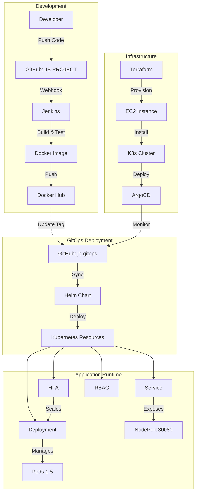
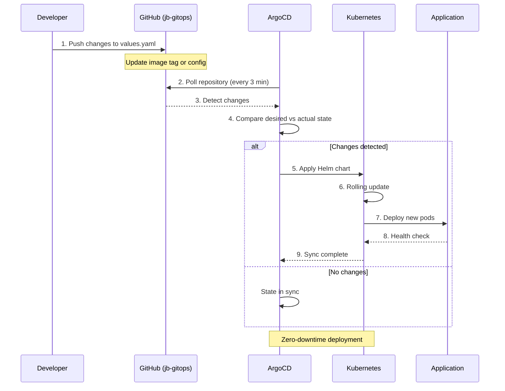
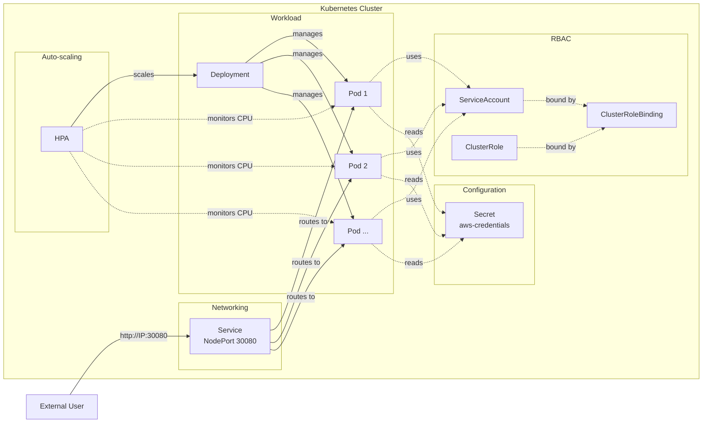
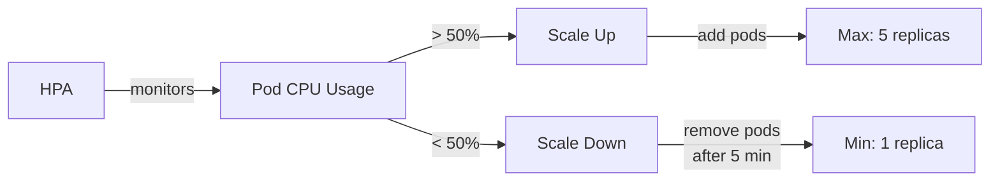
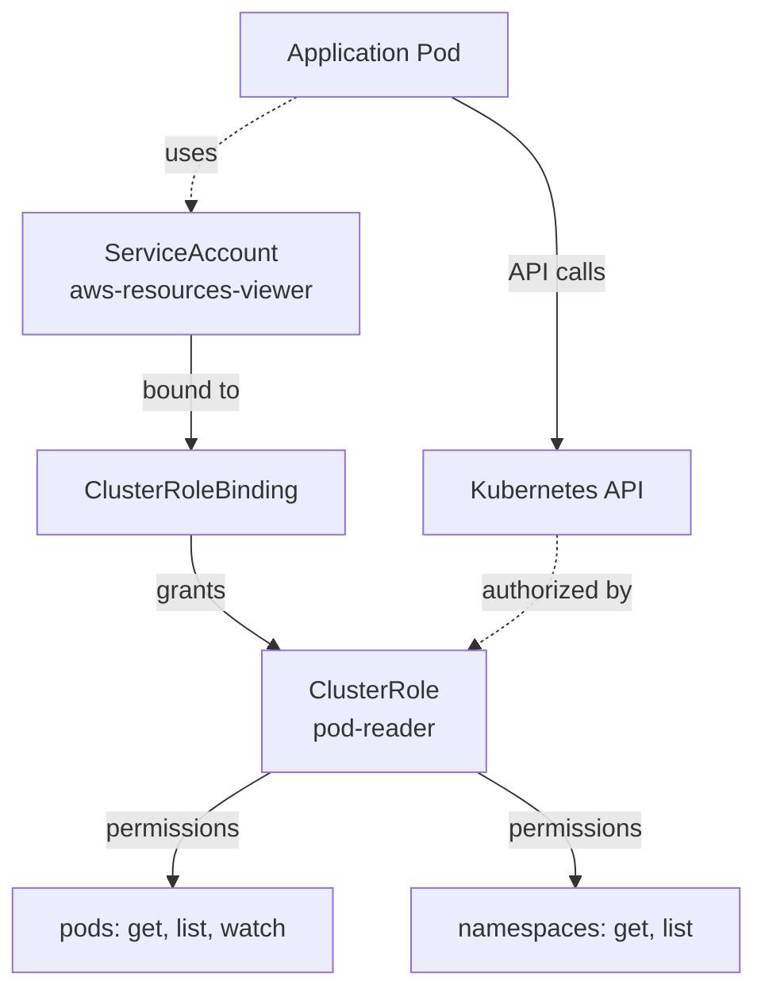
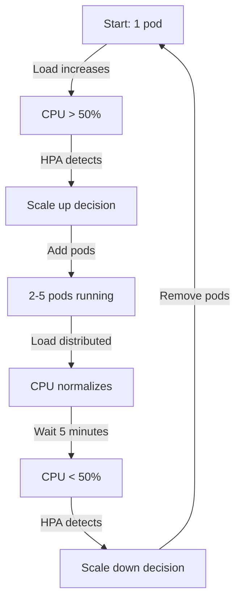
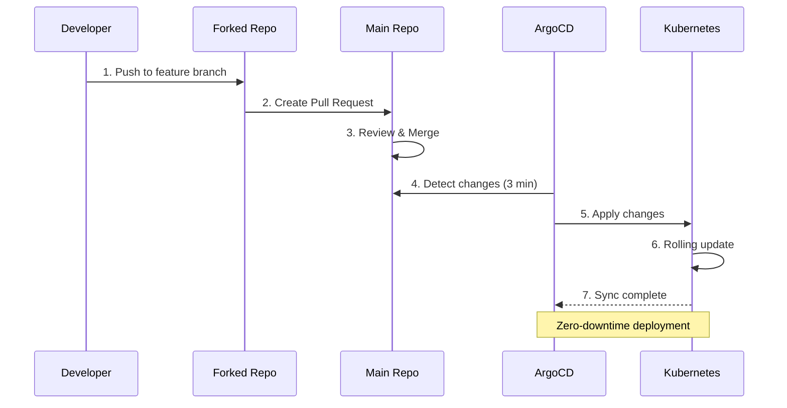

# AWS Resources Viewer - GitOps Repository

[](https://kubernetes.io/)
[](https://helm.sh/)
[](https://argoproj.github.io/cd/)
[](https://aws.amazon.com/)

GitOps repository for deploying and managing the AWS Resources Viewer application on Kubernetes using ArgoCD and Helm.

## 📋 Table of Contents

- [Overview](#-overview)
- [Architecture](#-architecture)
- [Project Structure](#-project-structure)
- [Features](#-features)
- [Prerequisites](#-prerequisites)
- [Deployment](#-deployment)
- [Configuration](#-configuration)
- [Monitoring](#-monitoring)
- [Troubleshooting](#-troubleshooting)
- [Testing](#-testing)
- [Contributing](#-contributing)
- [Additional Resources](#-additional-resources)

## 🎯 Overview

This repository contains the Helm chart and Kubernetes manifests for deploying the AWS Resources Viewer application. It follows GitOps principles, where ArgoCD continuously monitors this repository and automatically syncs changes to the Kubernetes cluster.

### Related Repositories

This repository is part of a complete CI/CD pipeline:

- **[JB-PROJECT](https://github.com/githuber20202/JB-PROJECT)** - Application source code (Flask app)
- **[jb-terraform](https://github.com/githuber20202/jb-terraform)** - Infrastructure as Code (EC2 + K3s + ArgoCD)
- **[jb-gitops](https://github.com/githuber20202/jb-gitops)** - GitOps manifests (this repository)

## 🏗️ Architecture

### Complete CI/CD Pipeline



### GitOps Workflow



### Kubernetes Resource Architecture



## 📦 Project Structure

```
jb-gitops/
├── README.md                       # This file
└── aws-resources-viewer/           # Helm Chart
    ├── Chart.yaml                  # Chart metadata (v0.1.0)
    ├── values.yaml                 # Default configuration values
    ├── .helmignore                 # Files to ignore during packaging
    └── templates/                  # Kubernetes manifest templates
        ├── _helpers.tpl            # Template helper functions
        ├── deployment.yaml         # Application deployment
        ├── service.yaml            # NodePort service (port 30080)
        ├── hpa.yaml                # Horizontal Pod Autoscaler
        ├── serviceaccount.yaml     # Service Account for the app
        └── rbac.yaml               # RBAC permissions (ClusterRole + Binding)
```

### Helm Chart Details

| File | Purpose | Key Features |
|------|---------|--------------|
| `Chart.yaml` | Chart metadata | Name, version (0.1.0), app version (1.0) |
| `values.yaml` | Configuration | Image tag, resources, HPA settings, service config |
| `deployment.yaml` | Pod specification | Container config, resource limits, env vars from Secret |
| `service.yaml` | Network exposure | NodePort 30080, targets port 5001 |
| `hpa.yaml` | Auto-scaling | CPU-based scaling (1-5 replicas, 50% target) |
| `serviceaccount.yaml` | Identity | Service account for pod authentication |
| `rbac.yaml` | Permissions | ClusterRole + Binding for pod/namespace read access |

## ✨ Features

### 🔄 Horizontal Pod Autoscaler (HPA)

The HPA automatically scales the application based on CPU utilization:



**Configuration:**
- **Min Replicas**: 1
- **Max Replicas**: 5
- **Target CPU**: 50%
- **Scale Up**: Immediate when CPU > 50%
- **Scale Down**: After 5 minutes of CPU < 50% (stabilization window)
- **API Version**: `autoscaling/v2`

### 🔐 RBAC Permissions

The application requires Kubernetes API access to display pod count:



**Permissions Granted:**
- **Resources**: `pods`, `namespaces`
- **Verbs**: `get`, `list`, `watch` (pods), `get`, `list` (namespaces)
- **Scope**: Cluster-wide (ClusterRole)
- **Purpose**: Display Kubernetes pod count in the application UI

### 🌐 Service Configuration

```yaml
Type: NodePort
Port: 5001 (internal)
TargetPort: 5001 (container)
NodePort: 30080 (external)
Access: http://<instance-ip>:30080
```

### 📊 Resource Management

```yaml
Limits:
  CPU: 200m
  Memory: 256Mi
Requests:
  CPU: 100m
  Memory: 128Mi
```

**Resource Allocation Strategy:**
- **Requests**: Guaranteed resources for scheduling
- **Limits**: Maximum resources the pod can use
- **Ratio**: 2:1 (limits:requests) for burstable workloads

## 🔧 Prerequisites

- **Kubernetes Cluster**: K3s, EKS, GKE, or any Kubernetes 1.19+
- **ArgoCD**: Installed and configured
- **Helm**: Version 3.x (for local testing)
- **AWS Credentials**: For the application to query AWS resources
- **Metrics Server**: Required for HPA functionality

### Verify Prerequisites

```bash
# Check Kubernetes version
kubectl version --short

# Check ArgoCD
kubectl get pods -n argocd

# Check Metrics Server (required for HPA)
kubectl get deployment metrics-server -n kube-system

# Check Helm version
helm version
```

## 🚀 Deployment

### Option 1: ArgoCD Application (Recommended)

This is the GitOps approach and the recommended deployment method.

#### Create ArgoCD Application

```yaml
apiVersion: argoproj.io/v1alpha1
kind: Application
metadata:
  name: aws-resources-viewer
  namespace: argocd
spec:
  project: default
  source:
    repoURL: https://github.com/githuber20202/jb-gitops.git
    targetRevision: main
    path: aws-resources-viewer
    helm:
      releaseName: aws-resources-viewer
      valueFiles:
        - values.yaml
  destination:
    server: https://kubernetes.default.svc
    namespace: default
  syncPolicy:
    automated:
      prune: true
      selfHeal: true
    syncOptions:
      - CreateNamespace=true
```

#### Apply the Application

```bash
# Save the above YAML to argocd-application.yaml
kubectl apply -f argocd-application.yaml

# Verify ArgoCD Application
argocd app get aws-resources-viewer

# Watch sync status
argocd app sync aws-resources-viewer --watch
```

#### Sync Policy Explained

- **automated.prune**: Remove resources deleted from Git
- **automated.selfHeal**: Revert manual changes to match Git
- **syncOptions.CreateNamespace**: Auto-create namespace if missing

### Option 2: Manual Helm Deployment

For testing or non-GitOps environments:

```bash
# Clone the repository
git clone https://github.com/githuber20202/jb-gitops.git
cd jb-gitops

# Install the Helm chart
helm install aws-resources-viewer ./aws-resources-viewer

# Or upgrade if already installed
helm upgrade aws-resources-viewer ./aws-resources-viewer

# Verify deployment
helm list
kubectl get pods -l app.kubernetes.io/name=aws-resources-viewer
```

### Option 3: Terraform (Fully Automated)

The [jb-terraform](https://github.com/githuber20202/jb-terraform) repository provides complete automation:

1. ✅ Creates EC2 instance with K3s
2. ✅ Installs ArgoCD
3. ✅ Creates AWS credentials Secret
4. ✅ Creates ArgoCD Application
5. ✅ Deploys this Helm chart

```bash
# Clone terraform repository
git clone https://github.com/githuber20202/jb-terraform.git
cd jb-terraform

# Initialize and apply
terraform init
terraform apply
```

## ⚙️ Configuration

### values.yaml Parameters

| Parameter | Description | Default | Type |
|-----------|-------------|---------|------|
| `replicaCount` | Initial number of replicas | `1` | integer |
| `image.repository` | Docker image repository | `formy5000/resources_viewer` | string |
| `image.tag` | Docker image tag | `sha-8917092` | string |
| `image.pullPolicy` | Image pull policy | `IfNotPresent` | string |
| `service.type` | Kubernetes service type | `NodePort` | string |
| `service.port` | Service port | `5001` | integer |
| `service.targetPort` | Container port | `5001` | integer |
| `service.nodePort` | NodePort for external access | `30080` | integer |
| `resources.limits.cpu` | CPU limit | `200m` | string |
| `resources.limits.memory` | Memory limit | `256Mi` | string |
| `resources.requests.cpu` | CPU request | `100m` | string |
| `resources.requests.memory` | Memory request | `128Mi` | string |
| `autoscaling.enabled` | Enable HPA | `true` | boolean |
| `autoscaling.minReplicas` | Minimum replicas | `1` | integer |
| `autoscaling.maxReplicas` | Maximum replicas | `5` | integer |
| `autoscaling.targetCPUUtilizationPercentage` | Target CPU for scaling | `50` | integer |
| `env` | Additional environment variables | `[]` | array |

### AWS Credentials Configuration

The application requires AWS credentials to query AWS resources. These are provided via a Kubernetes Secret:

```yaml
apiVersion: v1
kind: Secret
metadata:
  name: aws-credentials
  namespace: default
type: Opaque
stringData:
  AWS_ACCESS_KEY_ID: "your-access-key"
  AWS_SECRET_ACCESS_KEY: "your-secret-key"
  AWS_DEFAULT_REGION: "us-east-1"
```

**Important Notes:**
- The Secret name **must** be `aws-credentials` (referenced in `deployment.yaml`)
- The Terraform setup automatically creates this Secret during EC2 provisioning
- The Secret is loaded via `envFrom` in the deployment

#### Manual Secret Creation

```bash
kubectl create secret generic aws-credentials \
  --from-literal=AWS_ACCESS_KEY_ID=your-access-key \
  --from-literal=AWS_SECRET_ACCESS_KEY=your-secret-key \
  --from-literal=AWS_DEFAULT_REGION=us-east-1
```

### Customizing Values

#### Method 1: Custom values.yaml

Create a custom values file:

```yaml
# custom-values.yaml
replicaCount: 2

image:
  tag: "sha-latest"

autoscaling:
  enabled: true
  minReplicas: 2
  maxReplicas: 10
  targetCPUUtilizationPercentage: 70

resources:
  limits:
    cpu: 500m
    memory: 512Mi
  requests:
    cpu: 250m
    memory: 256Mi
```

Apply with Helm:
```bash
helm upgrade aws-resources-viewer ./aws-resources-viewer -f custom-values.yaml
```

#### Method 2: ArgoCD Application with Custom Values

Update the ArgoCD Application:

```yaml
spec:
  source:
    helm:
      values: |
        replicaCount: 2
        autoscaling:
          maxReplicas: 10
```

#### Method 3: Command-line Override

```bash
helm upgrade aws-resources-viewer ./aws-resources-viewer \
  --set replicaCount=2 \
  --set autoscaling.maxReplicas=10
```

## 📊 Monitoring

### Check Deployment Status

```bash
# View all resources
kubectl get all -l app.kubernetes.io/name=aws-resources-viewer

# View pods with details
kubectl get pods -l app.kubernetes.io/name=aws-resources-viewer -o wide

# View deployment status
kubectl rollout status deployment/aws-resources-viewer

# View HPA status
kubectl get hpa aws-resources-viewer

# Watch HPA in real-time
kubectl get hpa aws-resources-viewer -w

# View pod resource usage (requires metrics-server)
kubectl top pods -l app.kubernetes.io/name=aws-resources-viewer
```

### Check ArgoCD Sync Status

```bash
# Via CLI
argocd app get aws-resources-viewer

# Detailed sync status
argocd app get aws-resources-viewer --show-operation

# Via UI
# Navigate to: https://<instance-ip>:30443
# Login with admin credentials
```

### Application Logs

```bash
# View logs from all pods
kubectl logs -l app.kubernetes.io/name=aws-resources-viewer --tail=100 -f

# View logs from specific pod
kubectl logs <pod-name> -f

# View logs from previous pod instance (if crashed)
kubectl logs <pod-name> --previous

# View logs with timestamps
kubectl logs -l app.kubernetes.io/name=aws-resources-viewer --timestamps=true
```

### Service Endpoints

```bash
# Get service details
kubectl get svc aws-resources-viewer

# Get NodePort
kubectl get svc aws-resources-viewer -o jsonpath='{.spec.ports[0].nodePort}'

# Get node IP
kubectl get nodes -o wide

# Test endpoint
curl http://<node-ip>:30080
```

## 🐛 Troubleshooting

### Issue: Kubernetes API Error 403

**Symptom**: Application shows "⚠️ Kubernetes API error: 403"

**Cause**: Missing or incorrect RBAC permissions

**Solution**:
```bash
# Check ServiceAccount
kubectl get serviceaccount aws-resources-viewer

# Check ClusterRole
kubectl get clusterrole aws-resources-viewer-pod-reader

# Check ClusterRoleBinding
kubectl get clusterrolebinding aws-resources-viewer-pod-reader-binding

# Describe ClusterRole to verify permissions
kubectl describe clusterrole aws-resources-viewer-pod-reader

# If missing, redeploy the Helm chart
helm upgrade aws-resources-viewer ./aws-resources-viewer
```

### Issue: HPA Not Scaling

**Symptom**: Pods don't scale up despite high CPU

**Cause**: Metrics server not available or HPA misconfigured

**Solution**:
```bash
# Check metrics server
kubectl get deployment metrics-server -n kube-system

# If not installed, install metrics-server
kubectl apply -f https://github.com/kubernetes-sigs/metrics-server/releases/latest/download/components.yaml

# Check HPA status
kubectl describe hpa aws-resources-viewer

# Verify CPU metrics are available
kubectl top pods -l app.kubernetes.io/name=aws-resources-viewer

# Check HPA events
kubectl get events --field-selector involvedObject.name=aws-resources-viewer
```

**Common HPA Issues:**
- Metrics server not installed
- Resource requests not defined (required for HPA)
- Insufficient cluster resources
- HPA API version mismatch

### Issue: Pods Not Scaling Down

**Symptom**: Pods remain at high count despite low CPU

**Cause**: HPA scale-down stabilization window (default: 5 minutes)

**Solution**: This is normal behavior. HPA waits before scaling down to prevent flapping.

```bash
# Check HPA conditions
kubectl describe hpa aws-resources-viewer

# Look for: ScaleDownStabilized condition
# This means HPA is waiting before scaling down

# View HPA behavior
kubectl get hpa aws-resources-viewer -w
```

### Issue: Application Not Accessible

**Symptom**: Cannot access application at `http://<ip>:30080`

**Solution**:
```bash
# Check service
kubectl get svc aws-resources-viewer

# Verify NodePort is 30080
kubectl get svc aws-resources-viewer -o jsonpath='{.spec.ports[0].nodePort}'

# Check if pods are running
kubectl get pods -l app.kubernetes.io/name=aws-resources-viewer

# Check pod logs for errors
kubectl logs -l app.kubernetes.io/name=aws-resources-viewer

# Verify security group allows port 30080 (AWS)
# Check instance public IP
curl -I http://<instance-ip>:30080

# Test from within cluster
kubectl run -it --rm debug --image=curlimages/curl --restart=Never -- curl http://aws-resources-viewer:5001
```

### Issue: ArgoCD Out of Sync

**Symptom**: ArgoCD shows "OutOfSync" status

**Solution**:
```bash
# Manual sync
argocd app sync aws-resources-viewer

# Force sync (ignore differences)
argocd app sync aws-resources-viewer --force

# View sync status
argocd app get aws-resources-viewer

# View differences
argocd app diff aws-resources-viewer

# Or via UI: Click "Sync" button
```

### Issue: Image Pull Errors

**Symptom**: Pods stuck in `ImagePullBackOff` or `ErrImagePull`

**Solution**:
```bash
# Check pod events
kubectl describe pod <pod-name>

# Verify image exists
docker pull formy5000/resources_viewer:sha-8917092

# Check image pull policy
kubectl get deployment aws-resources-viewer -o jsonpath='{.spec.template.spec.containers[0].imagePullPolicy}'

# Update image tag in values.yaml if needed
```

### Issue: AWS Credentials Error

**Symptom**: Application shows AWS authentication errors

**Solution**:
```bash
# Check if Secret exists
kubectl get secret aws-credentials

# View Secret (base64 encoded)
kubectl get secret aws-credentials -o yaml

# Decode Secret values
kubectl get secret aws-credentials -o jsonpath='{.data.AWS_ACCESS_KEY_ID}' | base64 -d

# Verify Secret is mounted in pod
kubectl describe pod <pod-name> | grep -A 5 "Environment Variables from"

# Recreate Secret if needed
kubectl delete secret aws-credentials
kubectl create secret generic aws-credentials \
  --from-literal=AWS_ACCESS_KEY_ID=your-key \
  --from-literal=AWS_SECRET_ACCESS_KEY=your-secret \
  --from-literal=AWS_DEFAULT_REGION=us-east-1
```

## 🧪 Testing

### Test HPA Auto-Scaling

#### Generate Load

**Option 1: Using Apache Bench**
```bash
# Install Apache Bench
# Ubuntu/Debian: apt-get install apache2-utils
# macOS: brew install httpd
# Windows: Download from Apache website

# Generate load
ab -n 10000 -c 50 http://<instance-ip>:30080/
```

**Option 2: Using curl loop**
```bash
# Windows CMD
for /L %i in (1,1,1000) do curl http://<instance-ip>:30080/

# Linux/Mac
for i in {1..1000}; do curl http://<instance-ip>:30080/ & done

# PowerShell
1..1000 | ForEach-Object { Invoke-WebRequest -Uri "http://<instance-ip>:30080/" }
```

**Option 3: Using Python**
```python
import requests
import concurrent.futures
import time

url = "http://<instance-ip>:30080/"

def make_request(i):
    try:
        response = requests.get(url, timeout=5)
        print(f"Request {i}: Status {response.status_code}")
    except Exception as e:
        print(f"Request {i}: Error {e}")

# Generate load with 20 concurrent threads
with concurrent.futures.ThreadPoolExecutor(max_workers=20) as executor:
    executor.map(make_request, range(500))
```

#### Monitor Scaling Behavior

```bash
# Terminal 1: Watch HPA
kubectl get hpa aws-resources-viewer -w

# Terminal 2: Watch pods
kubectl get pods -l app.kubernetes.io/name=aws-resources-viewer -w

# Terminal 3: Monitor CPU usage
watch kubectl top pods -l app.kubernetes.io/name=aws-resources-viewer

# View HPA events
kubectl describe hpa aws-resources-viewer
```

#### Expected Behavior



**Timeline:**
1. **0:00** - Start with 1 pod
2. **0:30** - Load increases, CPU > 50%
3. **1:00** - HPA adds pods (up to 5)
4. **2:00** - Load distributes, CPU normalizes
5. **5:00** - Load stops, CPU < 50%
6. **10:00** - HPA removes pods (after 5-minute stabilization)
7. **11:00** - Back to 1 pod

### Test RBAC Permissions

```bash
# Check if app can list pods
kubectl exec -it <pod-name> -- curl -k -H "Authorization: Bearer $(cat /var/run/secrets/kubernetes.io/serviceaccount/token)" https://kubernetes.default.svc/api/v1/pods

# Verify ServiceAccount is mounted
kubectl exec -it <pod-name> -- ls -la /var/run/secrets/kubernetes.io/serviceaccount/

# Test from application
# Access http://<instance-ip>:30080 and verify pod count is displayed
```

### Test GitOps Workflow

```bash
# 1. Make a change to values.yaml
git clone https://github.com/githuber20202/jb-gitops.git
cd jb-gitops
# Edit aws-resources-viewer/values.yaml (e.g., change replicaCount to 2)

# 2. Commit and push
git add aws-resources-viewer/values.yaml
git commit -m "Test: Increase replicas to 2"
git push origin main

# 3. Watch ArgoCD sync (within 3 minutes)
argocd app get aws-resources-viewer -w

# 4. Verify changes applied
kubectl get deployment aws-resources-viewer -o jsonpath='{.spec.replicas}'
```

## 🤝 Contributing

### Making Changes

1. **Fork the repository**
   ```bash
   # Via GitHub UI or
   gh repo fork githuber20202/jb-gitops
   ```

2. **Clone your fork**
   ```bash
   git clone https://github.com/YOUR-USERNAME/jb-gitops.git
   cd jb-gitops
   ```

3. **Create a feature branch**
   ```bash
   git checkout -b feature/your-feature-name
   ```

4. **Make your changes**
   - Edit Helm chart files
   - Update values.yaml
   - Modify templates as needed

5. **Test locally** (optional but recommended)
   ```bash
   # Lint the Helm chart
   helm lint ./aws-resources-viewer
   
   # Dry-run to check generated manifests
   helm template aws-resources-viewer ./aws-resources-viewer
   
   # Validate Kubernetes manifests
   helm template aws-resources-viewer ./aws-resources-viewer | kubectl apply --dry-run=client -f -
   ```

6. **Commit and push**
   ```bash
   git add .
   git commit -m "feat: Description of your changes"
   git push origin feature/your-feature-name
   ```

7. **Create a Pull Request**
   - Go to GitHub
   - Click "New Pull Request"
   - Select your branch
   - Describe your changes

### Commit Message Convention

Follow [Conventional Commits](https://www.conventionalcommits.org/):

- `feat:` New feature
- `fix:` Bug fix
- `docs:` Documentation changes
- `chore:` Maintenance tasks
- `refactor:` Code refactoring
- `test:` Adding tests

Examples:
```bash
git commit -m "feat: add memory-based HPA scaling"
git commit -m "fix: correct NodePort value in service"
git commit -m "docs: update README with troubleshooting section"
```

### GitOps Workflow



**Once changes are merged to `main`:**
1. ArgoCD detects the change (within 3 minutes)
2. ArgoCD syncs the new configuration
3. Kubernetes applies the changes
4. Application is updated with zero downtime (rolling update)

### Testing Guidelines

Before submitting a PR:

- ✅ Helm chart lints successfully
- ✅ Templates render without errors
- ✅ Manifests are valid Kubernetes YAML
- ✅ Changes are documented in README (if applicable)
- ✅ Commit messages follow convention

## 📚 Additional Resources

### Documentation

- [Kubernetes Documentation](https://kubernetes.io/docs/)
- [Helm Documentation](https://helm.sh/docs/)
- [ArgoCD Documentation](https://argo-cd.readthedocs.io/)
- [HPA Documentation](https://kubernetes.io/docs/tasks/run-application/horizontal-pod-autoscale/)
- [RBAC Documentation](https://kubernetes.io/docs/reference/access-authn-authz/rbac/)

### Related Projects

- [Application Source Code](https://github.com/githuber20202/JB-PROJECT) - Flask application with AWS integration
- [Infrastructure Code](https://github.com/githuber20202/jb-terraform) - Terraform for EC2, K3s, and ArgoCD setup

### Tutorials & Guides

- [GitOps with ArgoCD](https://argo-cd.readthedocs.io/en/stable/user-guide/best_practices/)
- [Helm Best Practices](https://helm.sh/docs/chart_best_practices/)
- [Kubernetes Patterns](https://kubernetes.io/docs/concepts/cluster-administration/manage-deployment/)

## 📝 License

This project is part of a CI/CD demonstration and is provided as-is for educational purposes.

## 👤 Author

**Alexander Yasheyev**

---

**Note**: This is a GitOps repository. All changes should be made through Git commits, not directly in the cluster. ArgoCD will automatically sync changes from this repository to the Kubernetes cluster within 3 minutes.
